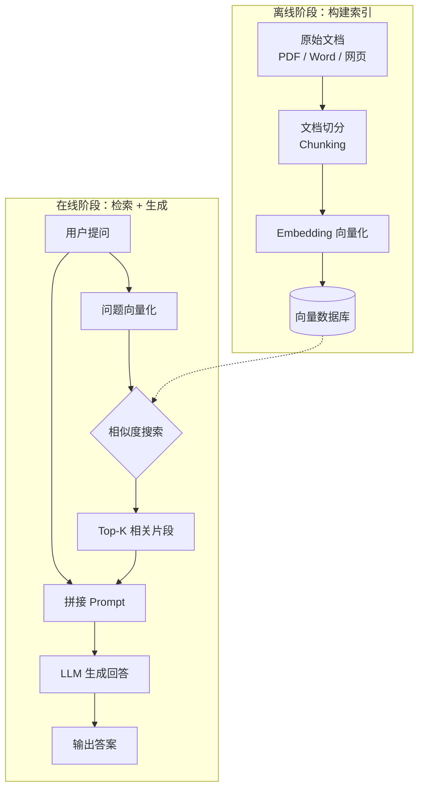

# RAG（检索增强生成）

## 概念解释

RAG（Retrieval-Augmented Generation，检索增强生成）是一种让大语言模型在回答问题之前，先从外部知识库中检索相关资料，再基于检索结果生成回答的技术架构。它最早由 Facebook AI Research（现 Meta AI）在 2020 年的论文中提出，目的是解决知识密集型任务中模型知识不足的问题。

为什么需要 RAG？因为 LLM（Large Language Model，大语言模型）有三个天然短板：第一，训练完成后知识就"冻结"了，无法获取新信息；第二，遇到不知道的问题会"一本正经地编造"，即产生幻觉（Hallucination）；第三，对企业内部文档、垂直领域知识了解有限。在 RAG 出现之前，主要靠微调（Fine-tuning）来注入领域知识，但微调成本高、更新慢。

RAG 的核心思路可以用一个类比概括：人回答问题时不需要把百科全书背下来，只要知道去哪查就行。RAG 就是给 LLM 配了一本"随时可翻的参考书"——每次回答前先查阅，再基于查到的内容组织答案。在 Agent 系统中，RAG 是最常见的知识接入方式，几乎所有需要领域知识的 Agent 都会用到它。

## 关键结构

RAG 系统由三个核心阶段串联而成，缺一不可：

| 阶段 | 作用 | 关键组件 |
|------|------|---------|
| 索引（Indexing） | 把原始文档转换为可快速检索的格式，离线执行一次 | 文档切分器、Embedding 模型、向量数据库 |
| 检索（Retrieval） | 根据用户问题找到最相关的文档片段，在线实时执行 | 检索器（Retriever）、相似度算法 |
| 生成（Generation） | 把检索到的资料和问题一起交给 LLM，生成最终回答 | Prompt 模板、LLM |

### 阶段 1：索引（Indexing）

索引阶段是离线准备工作，将原始文档加工成向量数据库可以存储和检索的格式。流程是：原始文档 -> 文本切分 -> 向量化 -> 存入向量数据库。

文档切分（Chunking）把长文档切成小片段，通常 500-1000 个 token。切分后，Embedding（嵌入）模型把每个片段转换为一个高维浮点数向量（比如 1536 维），语义相近的文本在向量空间中距离更近。最后把向量和原文一起存入向量数据库。

### 阶段 2：检索（Retrieval）

用户提问时实时执行。将用户问题用同一个 Embedding 模型转为向量，然后在向量数据库中做相似度搜索，找出与问题最相关的 K 个文档片段（通常 K=3~5）。搜索通常基于余弦相似度（Cosine Similarity）或欧氏距离（L2 Distance）。

### 阶段 3：生成（Generation）

将检索到的文档片段和用户问题拼接成一个 Prompt（提示词），输入 LLM。LLM 基于这些"参考资料"生成回答，而不是凭记忆编造。关键在于 Prompt 设计要引导 LLM 忠于检索结果，而非自由发挥。

## 核心原理

### 原理说明

RAG 的工作过程分为离线和在线两个阶段：

**离线阶段（一次性执行）**：
1. 收集原始文档（PDF、Word、网页、数据库记录等）
2. 用文档切分器将长文档切成小片段，相邻片段保留重叠区域（overlap）以维持上下文连贯
3. 用 Embedding 模型将每个片段转为向量
4. 将向量和原始文本一起存入向量数据库，建立检索索引

**在线阶段（每次查询执行）**：
1. 用户输入问题
2. 用同一个 Embedding 模型将问题转为向量
3. 在向量数据库中进行相似度搜索，取出最相关的 Top-K 片段
4. 将检索到的片段和用户问题拼接进 Prompt 模板
5. 将拼接后的 Prompt 发送给 LLM
6. LLM 基于提供的上下文生成回答

这套机制之所以有效，核心在于 Embedding 模型能将语义相近的文本映射到向量空间的相近位置，使得"意思接近"的内容可以通过数学计算找到，而不依赖关键词的精确匹配。

### Mermaid 图解



图中虚线表示向量数据库在在线阶段被查询但不被修改。整个流程的关键转换发生在两个地方：一是文档切分后的 Embedding 向量化（决定了检索质量的上限），二是 Prompt 的拼接方式（决定了 LLM 能否正确利用检索结果）。

### 运行示例

以下伪代码展示 RAG 的核心流程逻辑，不依赖具体框架：

```python
# RAG 核心流程伪代码

# --- 离线阶段：构建索引 ---
documents = load_documents("公司知识库/")       # 加载原始文档
chunks = split_into_chunks(documents, size=500) # 切成小片段
vectors = embedding_model.encode(chunks)        # 转为向量
vector_db.insert(vectors, chunks)               # 存入向量数据库

# --- 在线阶段：检索 + 生成 ---
question = "公司的年假政策是什么？"
q_vector = embedding_model.encode(question)     # 问题向量化
top_k = vector_db.search(q_vector, k=3)         # 相似度搜索，取 Top-3

# 拼接 Prompt
prompt = f"""基于以下参考资料回答问题，如果资料中没有答案请说明。
参考资料：{top_k}
问题：{question}"""

answer = llm.generate(prompt)                   # LLM 生成回答
```

上述伪代码对应 RAG 的三个阶段：`load_documents` + `split_into_chunks` + `embedding_model.encode` + `vector_db.insert` 是索引阶段；`vector_db.search` 是检索阶段；`llm.generate` 是生成阶段。实际项目中，LangChain、LlamaIndex 等框架封装了这些步骤，但底层逻辑不变。

## 易混概念辨析

| 概念 | 与 RAG 的区别 | 更适合关注的重点 |
|------|-------------|------------------|
| 微调（Fine-tuning） | 通过重新训练模型参数注入知识，改变模型本身；RAG 不改变模型，而是在推理时提供外部知识 | 改变模型行为风格、输出格式、推理方式 |
| Prompt Engineering | 只通过设计提示词引导 LLM 输出，不引入外部知识源；RAG 的关键是引入了检索环节 | 优化 LLM 对已有知识的表达方式 |
| 知识图谱（Knowledge Graph） | 用结构化的实体-关系网络组织知识，强调关系推理；RAG 通常基于非结构化文本的向量检索 | 实体间的复杂关系推理和多跳查询 |

核心区别：

- **RAG**：不改模型、不改知识表示方式，只在推理时检索外部文档作为上下文，核心是"检索 + 生成"的协作
- **微调**：直接修改模型权重，知识"内化"到模型参数中，更新成本高但不需要运行时检索
- **Prompt Engineering**：不引入外部知识，仅靠提示词技巧引导模型使用自身已有知识
- **知识图谱**：用结构化方式组织知识，擅长关系推理，但构建和维护成本高于文档知识库

## 适用边界与局限

### 适用场景

1. **企业知识库问答**：企业内部文档（政策、手册、技术文档）是私有的且持续更新，LLM 无法直接获取。RAG 通过外接知识库让通用 LLM 具备领域能力，无需微调。
2. **需要引用溯源的场景**：金融、医疗、法律等行业要求回答有据可查。RAG 可以展示回答依据的原始文档片段，满足合规和审计要求。
3. **知识频繁更新的场景**：产品文档、新闻资讯、行业报告等内容经常变化。RAG 只需更新知识库文档，新内容入库后立即可被检索，无需重新训练模型。

### 不适合的场景

1. **需要改变模型输出风格或格式的任务**：比如让模型以特定语气写作、按固定格式输出结构化数据。这类需求需要微调来改变模型行为，RAG 只能提供知识，不能改变模型的"表达方式"。
2. **需要深度多文档推理的复杂分析**：比如对比三份合同的条款差异。基础 RAG 擅长从单个片段提取答案，跨文档综合推理能力有限（Agentic RAG 正在尝试解决这个问题）。

### 局限性

1. **检索质量是整个系统的瓶颈**：如果检索到的文档片段不相关，后续生成质量必然下降。"垃圾进，垃圾出"在 RAG 中尤为突出，需要在 Embedding 模型选择、切分策略、混合检索等环节持续优化。
2. **增加响应延迟**：相比直接调用 LLM，RAG 多了 Embedding + 向量搜索环节，通常增加 200-500ms。如果加上重排序（Reranking）或多轮检索，延迟会进一步增加。
3. **知识库质量需要持续维护**：文档过时、错误、重复都会直接影响回答质量，需要定期审核和更新。

## 常见误区

| 常见误区 | 正确理解 |
|----------|----------|
| 有了 RAG 就不会产生幻觉 | RAG 能大幅降低幻觉，但如果检索结果不相关或 Prompt 设计不当，LLM 仍可能编造答案。RAG 是降低幻觉的手段，不是消除幻觉的银弹。 |
| RAG 就是把整个文档塞给 LLM | RAG 的核心是"精准检索"——找到最相关的小片段再提供给 LLM，而不是把整个文档全部输入。全量输入既超出上下文限制，也会引入大量噪音。 |
| 文档切得越小检索越精准 | 切太小会丢失上下文（比如只剩半句话），切太大会引入不相关内容。需要根据文档特点和业务场景调优 chunk_size，通常 500-1000 tokens 是合理起点。 |
| RAG 可以完全替代微调 | RAG 和微调解决不同问题。RAG 擅长补充外部事实知识，微调擅长改变模型行为（风格、格式、推理方式）。很多生产系统会同时使用两者。 |

## 思考题

<details>
<summary>初级：RAG 系统的三个核心阶段分别是什么？每个阶段的输入和输出各是什么？</summary>

**参考答案：**

三个阶段：索引（Indexing）、检索（Retrieval）、生成（Generation）。

- 索引阶段：输入是原始文档，输出是存入向量数据库的向量和文本片段。
- 检索阶段：输入是用户问题，输出是与问题最相关的 Top-K 文档片段。
- 生成阶段：输入是检索到的片段 + 用户问题（拼接成 Prompt），输出是 LLM 生成的回答。

</details>

<details>
<summary>中级：一个企业想让 LLM 用更正式的语气回答客户问题，同时能准确引用产品手册内容。应该用 RAG、微调，还是两者结合？为什么？</summary>

**参考答案：**

应该两者结合。RAG 负责从产品手册中检索准确的事实信息，确保回答内容正确且可溯源。微调负责调整模型的输出风格，使其采用正式语气回答。单用 RAG 无法改变语气风格，单用微调无法让模型获取最新的产品手册内容。

</details>

<details>
<summary>中级/进阶：用户问"A 产品和 B 产品哪个更适合小型团队？"，但 A 和 B 的信息分布在知识库的不同文档中。基础 RAG 可能出什么问题？你会如何改进？</summary>

**参考答案：**

基础 RAG 的 Top-K 检索可能只命中其中一个产品的文档片段，导致回答片面或缺少对比。改进思路：一是使用查询改写（Query Rewriting），将原问题拆分为"A 产品的特点"和"B 产品的特点"两个子查询分别检索；二是增大 K 值或使用多路召回，确保两个产品的文档都能被检索到；三是引入 Agentic RAG，让 Agent 判断需要多轮检索并自主组合结果。

</details>

## 参考资料

1. Lewis, P., et al. (2020). "Retrieval-Augmented Generation for Knowledge-Intensive NLP Tasks." *NeurIPS 2020*. https://arxiv.org/abs/2005.11401
2. Gao, Y., et al. (2024). "Retrieval-Augmented Generation for Large Language Models: A Survey." https://arxiv.org/abs/2312.10997
3. LangChain 官方文档 - RAG 教程. https://python.langchain.com/docs/tutorials/rag/
4. GitHub 资源 - What is Retrieval-Augmented Generation (RAG)? https://github.com/resources/articles/ai/software-development-with-retrieval-augmentation-generation-rag
