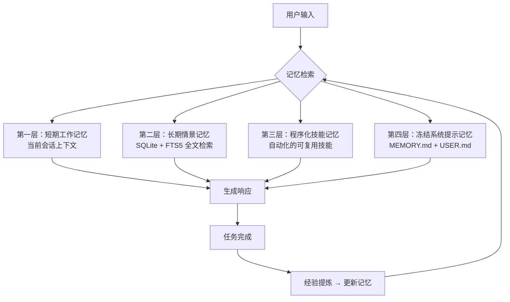

# Hermes Agent

## 基础概念

Hermes Agent 是 Nous Research 于 2026 年 2 月开源的自主 AI Agent 框架，核心卖点是**自我进化**——它不只是执行任务，还能从经验中自动提炼技能、在使用中持续改进、跨会话记住你的偏好和项目背景。

与 LangChain 这类需要开发者手动组装的编排框架不同，Hermes Agent 是一个**开箱即用的 Agent 运行时**：安装后直接对话，技能和记忆会随着使用自动积累。它的定位更接近"数字员工"而非"开发工具包"。

### 核心要素

| 要素 | 作用 |
|------|------|
| **学习闭环（Learning Loop）** | 从完成的任务中自动提炼可复用技能，下次遇到类似问题直接调用 |
| **四层记忆系统** | 短期工作记忆 + 长期情景记忆 + 程序化技能记忆 + 冻结系统提示记忆 |
| **多平台消息网关** | 统一接入 Telegram、Discord、Slack、WhatsApp、飞书等 20+ 平台 |
| **多模型支持** | 支持 OpenAI、Anthropic、OpenRouter（200+ 模型）、MiniMax、GLM 等 |
| **多执行后端** | 支持本地、Docker、SSH 远程主机、Daytona、Singularity、Modal 等 6 种运行环境 |

### 学习闭环

学习闭环是 Hermes Agent 最核心的差异化能力。工作流程如下：

1. **任务执行**：Agent 完成用户交给的任务
2. **经验提炼**：任务完成后，自动将操作序列抽象为可复用的技能（Skill）
3. **技能存储**：技能保存到技能库，下次遇到类似问题直接调用
4. **持续改进**：通过 GEPA（Genetic Evolution of Prompts and Agents）引擎自动评估、迭代、优化策略

### 四层记忆系统



各层记忆的职责：

| 层级 | 存储方式 | 生命周期 | 内容 |
|------|----------|----------|------|
| 短期工作记忆 | 模型上下文窗口 | 当前会话 | 即时对话上下文 |
| 长期情景记忆 | SQLite + FTS5 | 永久保存 | 跨会话的事实、偏好、项目背景 |
| 程序化技能记忆 | 技能文件 | 永久保存 | 自动提炼的可复用工作流 |
| 冻结系统提示记忆 | MEMORY.md / USER.md | 永久保存 | 环境事实（2200 字符）+ 用户画像（1375 字符） |

### 多平台消息网关

Hermes Agent 通过统一的 Gateway 服务接入多个消息平台，用户可以在任何习惯的工具中与 Agent 交互：

- **即时通讯**：Telegram、Discord、Slack、WhatsApp、Signal
- **国内平台**：飞书（Feishu/Lark）、企业微信（WeCom）
- **终端界面**：CLI 命令行、TUI 终端 UI
- **Web 界面**：内置 Web 面板

## 基础用法

安装依赖：

```bash
# 一行命令安装（支持 Linux、macOS、WSL2、Android Termux）
curl -fsSL https://raw.githubusercontent.com/NousResearch/hermes-agent/main/scripts/install.sh | bash

# 安装完成后加载环境变量
source ~/.bashrc  # 或 source ~/.zshrc
```

配置 LLM 提供商：

```bash
# 交互式配置向导（推荐新手）
hermes setup

# 或手动切换模型
hermes model
```

最小可运行示例：

```bash
# 启动交互式对话
hermes chat

# 或一次性提问
hermes chat "帮我写一个 Python 快速排序函数"
```

预期输出：

```text
✓ 已检索记忆：无相关历史
✓ 已调用技能：无匹配技能（首次使用）
✓ 生成响应...

这是一个 Python 快速排序实现：

def quicksort(arr):
    if len(arr) <= 1:
        return arr
    pivot = arr[len(arr) // 2]
    left = [x for x in arr if x < pivot]
    middle = [x for x in arr if x == pivot]
    right = [x for x in arr if x > pivot]
    return quicksort(left) + middle + quicksort(right)

✓ 已记录经验：Python 排序算法偏好
```

常用管理命令：

```bash
# 检查环境依赖
hermes doctor

# 查看当前配置
hermes config

# 启动消息网关
hermes gateway start

# 管理记忆文件
hermes memory

# 查看已创建的技能
hermes skills list
```

## 同类工具对比

| 维度 | Hermes Agent | LangChain | AutoGPT | Claude Code |
|------|--------------|-----------|---------|-------------|
| 核心定位 | 自我进化型 Agent 运行时 | Agent 编排框架 | 自主任务执行 Agent | IDE 集成编程 Agent |
| 学习能力 | 内置学习闭环，自动提炼技能 | 无内置学习，需手动实现 | 有限的记忆能力 | 会话内上下文学习 |
| 记忆系统 | 四层记忆架构 | 需自行集成 Memory 模块 | 简单的长期记忆 | 会话级上下文 |
| 部署方式 | 一行命令安装，开箱即用 | 需要开发集成 | 需要配置环境 | IDE 插件 |
| 适合场景 | 长期使用的个人 AI 助手 | 构建定制化 Agent 应用 | 自动化任务执行 | 编程辅助 |

核心区别：

- **Hermes Agent**：强调"越用越聪明"，适合长期陪伴型使用，不需要编程能力
- **LangChain**：开发框架，适合构建定制化 Agent 应用，需要编程能力
- **AutoGPT**：早期自主 Agent，缺乏系统性的学习闭环
- **Claude Code**：IDE 集成，专注编程场景，不是独立运行时

## 常见误区

| 误区 | 准确理解 |
|------|----------|
| Hermes Agent 是一个多 Agent 协作框架 | 它是单 Agent 运行时，专注于单个 Agent 的自我进化，不涉及多 Agent 编排 |
| 需要编程能力才能使用 | 安装后直接对话即可，技能和记忆自动积累，无需写代码 |
| 学习闭环意味着它会自动变好 | 学习闭环依赖足够的使用频次和任务多样性，初期需要用户耐心使用 |
| 它可以替代 LangChain | 它们定位不同：Hermes 是运行时，LangChain 是开发框架 |

## 优劣势分析

| 优势 | 劣势 |
|------|------|
| 开箱即用，一行命令安装 | 资源消耗较大，建议 4GB+ 内存 |
| 内置学习闭环，越用越聪明 | 学习效果依赖使用频次 |
| 四层记忆系统，跨会话持久化 | 记忆容量有限（MEMORY.md 仅 2200 字符） |
| 支持 20+ 消息平台 | 中文文档和教程相对较少 |
| 支持 200+ LLM 模型 | 生态仍在发展中，插件数量有限 |
| MIT 开源，社区活跃（150k+ Stars） | 架构复杂，调试需要一定技术背景 |

## 思考题

<details>
<summary>初级：Hermes Agent 的"学习闭环"具体指什么？</summary>

**参考答案：**

学习闭环是指 Agent 完成任务后，自动将操作序列抽象为可复用的技能（Skill），保存到技能库中。下次遇到类似问题时，直接调用已有技能，而不是从零开始。同时通过 GEPA 引擎持续评估和优化已有技能。

</details>

<details>
<summary>中级：Hermes Agent 的四层记忆系统各层分别解决什么问题？</summary>

**参考答案：**

- 短期工作记忆：维持单次对话的连贯性，生命周期为当前会话
- 长期情景记忆：跨会话记住用户的项目背景、偏好、习惯，使用 SQLite + FTS5 支持全文检索
- 程序化技能记忆：将反复执行的复杂操作固化为自动化技能
- 冻结系统提示记忆：存储环境事实（MEMORY.md）和用户画像（USER.md），注入到每次对话的系统提示中

</details>

<details>
<summary>中级：Hermes Agent 和 LangChain 的本质区别是什么？分别适合什么场景？</summary>

**参考答案：**

本质区别在于定位：Hermes Agent 是一个**运行时**，安装后直接使用，技能和记忆自动积累；LangChain 是一个**开发框架**，需要开发者用代码组装 Chain、Agent、Tool 等组件。

适合场景：
- Hermes Agent：长期陪伴型使用，个人 AI 助手，不需要编程能力
- LangChain：构建定制化 Agent 应用，需要精细控制 Agent 行为，需要编程能力

</details>

## 参考资料

1. GitHub 仓库：https://github.com/NousResearch/hermes-agent
2. 官方文档：https://hermes-agent.nousresearch.com/
3. 技术架构解析：https://cloud.tencent.com/developer/article/2652528
4. 记忆系统源码解析：https://blog.csdn.net/qq_23625847/article/details/160147456
