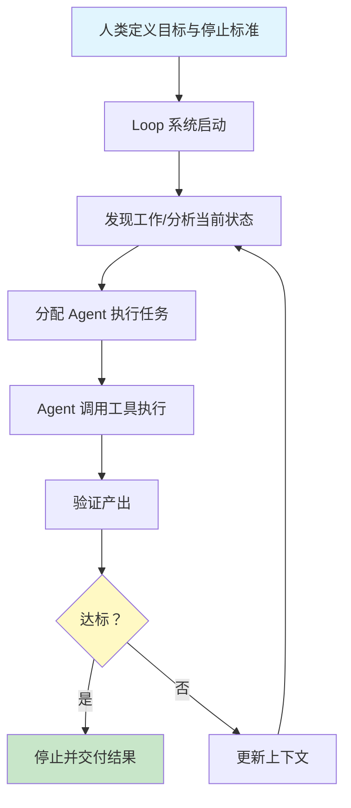

# Loop Engineering（循环工程）

## 模式概述

> 一句话概括：用你设计的系统来替代你自己去 prompt Agent。

Loop Engineering（循环工程）是2026年6月在 AI 编程社区迅速传播的一个新概念。2026年6月7日，OpenClaw 创始人、OpenAI 开发者 Peter Steinberger 在 X 平台发布推文："Here's your monthly reminder that you shouldn't be prompting coding agents anymore. You should be designing loops that prompt your agents."（每月提醒：你不该再给编程 Agent 写提示词了，你应该设计循环来提示你的 Agent。）这条推文在24小时内突破数百万浏览量，引发全网热议。

其核心主张是：**不应该再给编程 Agent 写提示词，而应该设计一套能让 Agent 自主迭代的循环系统**。继 Prompt Engineering、Context Engineering、Harness Engineering 之后，Loop Engineering 成为 AI 工程方法论的第四次范式跃迁，标志着人在 AI 工作流中的角色从"逐句指挥者"转变为"系统设计者"。Google 工程师 Addy Osmani 系统整理了这一概念，Anthropic Claude Code 负责人 Boris Cherny 也公开表示自己已完全停止手动输入提示词，日常工作仅搭建循环框架。

## 核心模块

Loop Engineering 的骨架由五个核心要素构成，缺一不可：

| 要素 | 作用 | 与其他要素的关系 |
|------|------|------------------|
| 明确目标 | 定义 Agent 要达成的最终状态 | 所有迭代都围绕这个目标展开 |
| 上下文管理 | 维护 Agent 执行所需的状态和历史 | 为 Agent 提供决策依据 |
| 可调用工具 | 提供 Agent 能力的边界 | Agent 通过工具与外部世界交互 |
| 产出评估 | 判断当前结果是否达标 | 决定是否继续迭代或停止 |
| 停止标准 | 定义循环终止的条件 | 防止无限循环，控制成本 |

### 要素 1：明确目标

目标不是一条具体的指令，而是 Agent 要达成的最终状态描述。例如"修复这个 bug 并通过所有测试"，而不是"先读文件，再找到第 42 行，然后把 x 改成 y"。

### 要素 2：上下文管理

Agent 在每次迭代时需要知道：之前做了什么、结果如何、当前状态是什么。上下文管理负责维护这些信息，确保 Agent 能做出有依据的决策。

### 要素 3：可调用工具

Agent 需要通过工具与外部世界交互：读写文件、运行测试、调用 API、搜索文档等。工具定义了 Agent 的能力边界。

### 要素 4：产出评估

每次迭代后，系统需要判断当前结果是否达标。评估可以是自动的（如测试通过率）或人工的（如代码审查）。

### 要素 5：停止标准

停止标准防止 Agent 陷入无限循环，同时控制 Token 成本。常见的停止条件包括：目标达成、达到最大迭代次数、成本超过预算。

## 架构图

上图展示了 Loop Engineering 的核心循环：人类在最顶层定义目标和停止标准，Loop 系统自动完成"发现工作 → 分配 Agent → 执行 → 验证 → 决定下一步"的闭合回路。

## 工作流程

1. **步骤 1：定义系统** — 人类设定目标、配置工具、定义评估标准和停止条件。这是人类唯一的"手动"步骤。
2. **步骤 2：启动循环** — Loop 系统根据目标分析当前状态，确定第一步要做什么。
3. **步骤 3：分配执行** — 系统将任务分配给 Agent，Agent 调用可用工具执行。
4. **步骤 4：验证结果** — 系统评估 Agent 的产出是否达标。
5. **步骤 5：决策分支** — 如果达标，停止并交付结果；如果不达标，更新上下文，回到步骤 2 继续迭代。

### 五种 Loop 模式

根据任务特点，Loop Engineering 提供了五种典型模式：

| 模式 | 适用场景 | 核心逻辑 |
|------|----------|----------|
| **Retry Loop** | 目标明确、有清晰 pass/fail 标准 | 执行 → 检查 → 失败则重试 → 通过则停止 |
| **Plan-Execute-Verify** | 多步骤复杂任务 | 先规划完整计划 → 分步执行 → 每步验证 → 失败时重规划 |
| **Explore-Narrow** | 方案未知，需要探索 | 广泛探索多种可能 → 逐步缩小范围 → 收敛到最优方案 |
| **Human-in-the-Loop** | 高风险决策 | Agent 执行 → 关键节点请求人工确认 → 人工批准后继续 |
| **Lifecycle Loop** | 长期运行项目 | 持续监控 → 自动响应变化 → 周期性复盘与优化 |

### 执行示例

以"修复一个导致测试失败的 bug"为例，使用 Retry Loop 模式：

1. **定义系统**：目标是"所有测试通过"；工具包括文件读写、测试运行；停止标准是测试全部通过或重试 3 次。
2. **第一次迭代**：Agent 分析失败的测试，定位到 `utils.py` 第 42 行的类型错误，修复后运行测试——仍然失败。
3. **第二次迭代**：Agent 发现还有一个相关的边界条件未处理，补充修复后运行测试——全部通过。
4. **停止**：目标达成，Loop 结束。

整个过程中，人类只在第一步定义了目标和规则，后续所有决策都由 Loop 系统自动完成。

## 适用场景

### 适合的场景

1. **代码修复与重构**：目标明确（测试通过、lint 通过），适合 Retry Loop 或 Plan-Execute-Verify。
2. **多步骤复杂任务**：需要分阶段执行并验证的任务，适合 Plan-Execute-Verify。
3. **方案探索**：不确定最佳方案时，适合 Explore-Narrow 先发散再收敛。
4. **高风险操作**：涉及生产环境或敏感数据时，适合 Human-in-the-Loop 保留人工控制。
5. **长期维护项目**：需要持续响应变化的系统，适合 Lifecycle Loop。

### 不适合的场景

1. **简单单次任务**：如果任务只需一次执行就能完成，Loop 的额外开销不值得。
2. **成本敏感场景**：Loop 的多次迭代会消耗大量 Token，成本可能超出预算。
3. **需要精确控制每一步**：如果业务流程已完全标准化，确定性 Workflow 比 Loop 更合适。

## 与其他范式的关系

| 范式 | 关注点 | 与 Loop Engineering 的关系 |
|------|--------|---------------------------|
| **Prompt Engineering** | 如何写好单条提示词 | Loop Engineering 主张"不要再写提示词"，而是设计循环系统 |
| **Context Engineering** | 如何管理上下文信息 | Context Engineering 是 Loop 的五要素之一 |
| **Harness Engineering** | 如何搭建 Agent 运行时框架 | Harness 是 Loop 的基础设施层 |
| **ReAct 范式** | 推理与行动的交替循环 | ReAct 是 Loop 内部的一种执行模式 |
| **Plan-and-Solve** | 先规划后执行 | Plan-Execute-Verify Loop 融合了这一思想 |

## 优劣势分析

| 优势 | 劣势 |
|------|------|
| 释放人力：人从"逐句指挥"变为"系统设计" | Token 成本高：多次迭代消耗大量 Token |
| 自主迭代：Agent 能自我修正，减少人工干预 | 系统复杂度：设计一个良好的 Loop 系统本身需要工程能力 |
| 可复用：设计好的 Loop 系统可反复使用 | 认知风险：Agent 可能在错误方向上越走越远 |
| 灵活适配：五种模式覆盖不同场景 | 调试困难：Loop 的黑盒特性增加了问题排查难度 |

## 常见误区

| 常见误区 | 正确理解 |
|----------|----------|
| Loop Engineering 就是写更好的 Prompt | Loop Engineering 的核心是设计循环系统，而不是写提示词 |
| Loop 等于 ReAct 循环 | ReAct 是 Agent 内部的推理-行动模式，Loop 是更上层的系统设计范式 |
| 所有任务都应该用 Loop | 简单任务用 Loop 反而增加成本和复杂度，要根据场景选择 |
| Loop 能完全替代人工 | 高风险场景仍需 Human-in-the-Loop 保留人工控制 |

## 思考题

初级：Loop Engineering 的五要素是什么？

**参考答案：**

五要素是：明确目标、上下文管理、可调用工具、产出评估、停止标准。这五个要素共同构成了 Loop 系统的骨架，缺一不可。

中级：Retry Loop 和 Plan-Execute-Verify 的区别是什么？分别适合什么场景？

**参考答案：**

Retry Loop 是最简单的 Loop 模式，逻辑是"执行 → 检查 → 失败则重试"，适合目标明确、有清晰 pass/fail 标准的原子任务（如修复 lint 错误）。

Plan-Execute-Verify 更复杂，先生成完整计划，再分步执行并验证，失败时可以重规划，适合多步骤复杂任务（如实现一个新功能）。

中级：Loop Engineering 和 Prompt Engineering 的本质区别是什么？

**参考答案：**

Prompt Engineering 关注的是"如何写好单条提示词"，人是执行者，Agent 是指令接收者。

Loop Engineering 关注的是"如何设计循环系统"，人是系统设计者，Agent 是自主执行者。Loop Engineering 的核心主张是"不要再写提示词，而是设计能让 Agent 自主迭代的系统"。

## 参考资料

1. SegmentFault 思否：[Loop Engineering 是什么?2026 年最热 AI 工程方法论完全解析](https://segmentfault.com/a/1190000047863662)
2. 菜鸟教程：[Loop Engineering(循环工程)](https://www.runoob.com/ai-agent/loop-engineering.html)
3. 腾讯云开发者：[Loop Engineering入门系列03:AI Agent自动化的5种Loop模式和决策表](https://cloud.tencent.com/developer/article/2696311)
4. CSDN 博客：[Loop Engineering:AI 编程范式的下一次跃迁](https://blog.csdn.net/linjiuxiansheng/article/details/161914797)
