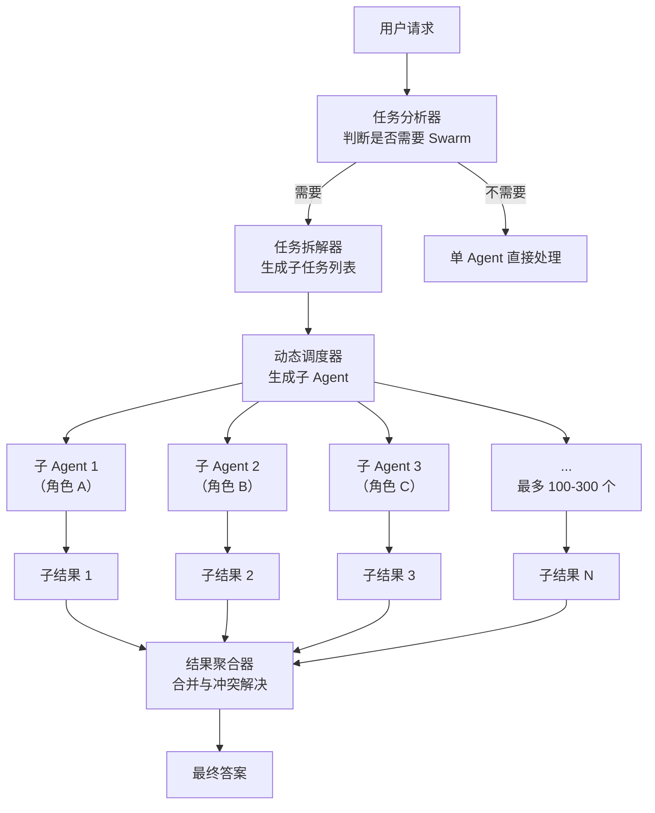

# Kimi Agent Swarm（Kimi 智能体集群）

## 模式概述

Kimi Agent Swarm 是月之暗面（Moonshot AI）在其 Kimi K2.5 及后续模型中引入的一种**内生多智能体集群协作机制**。与传统的多 Agent 框架不同，Agent Swarm 不是需要开发者手动编排的外部工具，而是模型本身具备的能力——当面对复杂任务时，模型会自动拆解任务、动态生成多个子 Agent、分配角色并并行执行，最终汇总结果。

这种模式的核心价值在于**零人工编排**。开发者不需要预先定义 Master-Worker 结构、不需要手动配置 Agent 角色、不需要写任务分解逻辑——模型自己判断什么时候需要"集群作战"，自己决定拆成多少个子任务、每个子 Agent 负责什么。这种"模型即编排器"的设计，把多 Agent 协作的门槛从"需要懂架构"降低到"只需要描述任务"。

> 一句话概括：Agent Swarm 让模型自己当"项目经理"，自动组建临时团队、分配任务、并行执行、汇总结果，开发者只需提出需求。

## 核心模块

Agent Swarm 的核心在于模型内生的任务理解、拆解、调度与汇总能力，可以拆解为四个关键模块：

| 模块 | 作用 | 与其他模块的关系 |
|------|------|------------------|
| 任务分析器 | 理解用户请求，判断是否需要多 Agent 协作 | 是整个流程的入口，决定是否触发 Swarm 模式 |
| 任务拆解器 | 将复杂任务分解为可并行的子任务 | 接收任务分析器的输出，为调度器提供任务列表 |
| 动态调度器 | 生成子 Agent、分配角色、管理并行执行 | 接收子任务列表，创建并管理 100-300 个子 Agent |
| 结果聚合器 | 收集所有子 Agent 的输出，合并为最终答案 | 接收所有子 Agent 的结果，处理冲突和失败情况 |

### 模块 1：任务分析器

任务分析器是 Agent Swarm 的"决策中枢"。它接收用户的自然语言请求后，会判断：

- 这个任务是否足够复杂，需要多 Agent 协作？
- 如果需要，应该拆成几个子任务？
- 哪些子任务可以并行，哪些有依赖关系？

这个判断过程完全由模型自主完成，不需要开发者提供任何配置或提示词模板。

### 模块 2：任务拆解器

任务拆解器负责将复杂任务分解为多个相对独立的子任务。与传统 Master-Worker 模式中需要开发者预先定义分解逻辑不同，Agent Swarm 的拆解是**动态的、自适应的**——模型会根据任务的具体内容，实时决定拆解策略。

例如，面对"分析 AI 在医疗、金融、教育三个行业的应用"这个任务，模型会自动拆成三个并行子任务；而面对"先研究市场趋势，再根据趋势制定产品策略"这个任务，模型会识别出顺序依赖，按序执行。

### 模块 3：动态调度器

动态调度器是 Agent Swarm 最具特色的模块。它不是简单地调用预定义的 Agent，而是**实时生成**子 Agent，并为每个子 Agent 分配：

- 专属的角色描述（System Prompt）
- 专用的工具集（Tools）
- 具体的子任务描述

根据月之暗面官方数据，Kimi K2.5 最多可调度 100 个子 Agent，Kimi K2.6 进一步提升到 300 个子 Agent，支持上千步任务执行流程。

### 模块 4：结果聚合器

结果聚合器负责收集所有子 Agent 的输出，并处理以下情况：

- **全部成功**：合并所有结果，整理成连贯的最终输出
- **部分失败**：对失败的子任务决定是重试、跳过，还是用已有结果降级输出
- **结果冲突**：不同子 Agent 返回了矛盾信息时，进行冲突解决

## 架构图



流程说明：

- **User → Analyzer**：用户提交请求，任务分析器判断复杂度
- **Analyzer → Decomposer**：如果任务足够复杂，触发 Swarm 模式，进入任务拆解
- **Decomposer → Scheduler**：生成子任务列表，交给动态调度器
- **Scheduler → 子 Agent**：调度器实时生成 N 个子 Agent，分配角色和任务
- **子 Agent → 子结果**：所有子 Agent 并行执行，各自返回结果
- **子结果 → Aggregator**：结果聚合器收集所有输出，处理冲突和失败
- **Aggregator → Final**：输出最终答案

关键控制点是"任务分析器"——它决定了是否触发 Swarm 模式。对于简单任务，模型会直接用单 Agent 处理，避免不必要的开销。

## 工作流程

1. **步骤 1（任务分析）：** 用户提交请求后，模型首先判断任务复杂度。如果任务足够复杂（如多维度分析、大规模数据处理、需要多领域知识），则触发 Swarm 模式。

2. **步骤 2（任务拆解）：** 模型将复杂任务分解为 N 个子任务。拆解时考虑：子任务间的依赖关系、并行可行性、每个子任务的复杂度。

3. **步骤 3（动态生成子 Agent）：** 调度器为每个子任务实时生成一个子 Agent，分配专属的角色描述、工具集和任务描述。所有子 Agent 同时启动执行。

4. **步骤 4（并行执行）：** 100-300 个子 Agent 并行工作，各自独立完成分配到的任务。每个子 Agent 可以调用工具、访问网络、处理数据。

5. **步骤 5（结果汇总）：** 结果聚合器收集所有子 Agent 的输出，处理失败和冲突，合并为最终答案返回给用户。

**终止条件：**
- 所有子 Agent 成功返回 → 聚合器汇总后输出最终答案
- 部分子 Agent 失败 → 重试或降级，用已有结果合成最佳答案
- 达到最大执行步数（上千步）→ 返回部分结果并说明缺失项

### 执行示例

用户请求：**"帮我做一份 2026 年 AI Agent 技术趋势分析报告，涵盖技术、市场、人才三个维度"**

**第 1 步：任务分析器判断**

```
任务分析：
- 复杂度：高（多维度、需要大量信息收集和分析）
- 决策：触发 Swarm 模式
```

**第 2 步：任务拆解器分解**

```
子任务列表：
  子任务 1：收集 2026 年 AI Agent 技术发展动态 → 分配给技术研究 Agent
  子任务 2：分析 AI Agent 市场规模和投融资情况 → 分配给市场分析 Agent
  子任务 3：调研 AI Agent 人才需求和薪资趋势 → 分配给人才研究 Agent
  子任务 4：整理主流 Agent 框架对比 → 分配给技术评测 Agent
  子任务 5：收集行业应用案例 → 分配给案例研究 Agent
```

**第 3 步：动态调度器生成子 Agent**

```
调度器实时生成 5 个子 Agent：
- 技术研究 Agent：角色="AI 技术分析师"，工具=[搜索引擎、论文数据库]
- 市场分析 Agent：角色="市场研究专家"，工具=[金融数据API、搜索引擎]
- 人才研究 Agent：角色="HR 数据分析师"，工具=[招聘网站API、搜索引擎]
- 技术评测 Agent：角色="技术架构师"，工具=[GitHub API、文档搜索]
- 案例研究 Agent：角色="行业研究员"，工具=[搜索引擎、新闻API]
```

**第 4 步：5 个子 Agent 并行执行**

```
技术研究 Agent：搜索技术论文 → 整理 5 个技术趋势 → 返回结构化结果
市场分析 Agent：查询市场数据 → 分析投融资趋势 → 返回结构化结果
人才研究 Agent：爬取招聘数据 → 分析薪资分布 → 返回结构化结果
技术评测 Agent：对比主流框架 → 整理优劣势 → 返回结构化结果
案例研究 Agent：收集行业案例 → 整理 10 个典型案例 → 返回结构化结果

5 个 Agent 同时执行，总耗时约 60 秒
```

**第 5 步：结果聚合器汇总**

```
聚合器收到 5 份子结果：
- 检查状态：5 个 Agent 全部成功
- 合并数据：技术趋势 + 市场数据 + 人才分析 + 框架对比 + 应用案例
- 补充分析：跨维度关联分析、未来展望
- 输出：一份包含五个章节的完整报告
```

总耗时约 90 秒（60 秒并行执行 + 30 秒汇总），远快于串行执行的 300 秒。

## 适用场景

### 适合的场景

1. **大规模多维度分析任务**：如市场研究报告、行业趋势分析、竞品对比等需要同时处理多个维度的任务。Agent Swarm 可以让多个子 Agent 并行收集和分析数据，效率提升 10 倍以上。

2. **需要多领域知识的复杂任务**：如技术方案评审需要同时考虑架构、安全、性能、成本等多个方面。每个子 Agent 专注于一个领域，专业性高于通用 Agent。

3. **长周期执行任务**：如持续监控、周期性报告生成、大规模数据处理等需要长时间运行的任务。Agent Swarm 支持上千步执行流程，可以处理单个 Agent 无法完成的超长任务。

4. **需要动态调整策略的任务**：如探索性研究、开放性问题求解等任务，执行过程中可能需要根据中间结果调整方向。Agent Swarm 的动态调度能力可以实时调整子 Agent 的数量和角色。

### 不适合的场景

1. **简单任务**：查天气、翻译一句话、简单问答等任务，一次 LLM 调用就能完成，触发 Swarm 模式只会增加不必要的开销和延迟。

2. **强顺序依赖任务**：如果任务的每一步都必须等上一步完成才能开始，并行化没有意义。此时用 ReAct 或 Planner-Executor 模式更直接。

3. **需要精确控制的任务**：如果开发者需要精确控制每个 Agent 的行为、工具调用、输出格式，Agent Swarm 的自动化特性反而会成为限制。此时应该用传统的 Master-Worker 模式，手动编排 Agent。

4. **成本敏感的任务**：Agent Swarm 会生成大量子 Agent，每个子 Agent 都会消耗 token。如果任务预算有限，应该评估是否真的需要这么多 Agent。

## 典型实现

Agent Swarm 是 Kimi 模型的内生能力，开发者无法直接控制其内部实现。但可以通过 Kimi API 触发 Swarm 模式：

```python
# 基于 Kimi API 触发 Agent Swarm（伪代码示意）
# 依赖：openai（兼容 Kimi API）

from openai import OpenAI

# 初始化 Kimi 客户端
client = OpenAI(
    api_key="your-kimi-api-key",
    base_url="https://api.moonshot.cn/v1"
)

# 提交复杂任务，模型会自动判断是否触发 Swarm
response = client.chat.completions.create(
    model="kimi-k2.5",  # 或 kimi-k2.6
    messages=[
        {
            "role": "user",
            "content": "帮我做一份 2026 年 AI Agent 技术趋势分析报告，涵盖技术、市场、人才三个维度"
        }
    ]
)

# 模型会自动：
# 1. 判断任务复杂度
# 2. 拆解为多个子任务
# 3. 生成子 Agent 并行执行
# 4. 汇总结果返回最终答案

print(response.choices[0].message.content)
```

代码说明：开发者只需要像调用普通 LLM 一样提交请求，模型会自动判断是否需要触发 Swarm 模式。不需要手动配置 Agent 角色、不需要写任务分解逻辑、不需要管理并行执行——这一切都由模型内生完成。

## 优劣势分析

| 优势 | 劣势 |
|------|------|
| 零人工编排：开发者只需描述任务，模型自动完成所有编排工作 | 黑盒性：开发者无法精确控制子 Agent 的数量、角色和行为 |
| 大规模并行：支持 100-300 个子 Agent 并行，效率提升 10 倍以上 | 成本不可控：子 Agent 数量由模型决定，token 消耗难以预估 |
| 动态自适应：模型根据任务特点实时调整拆解策略和 Agent 数量 | 依赖模型能力：如果模型判断失误（不该拆的拆了、该拆的没拆），效果会大打折扣 |
| 支持长周期执行：上千步任务执行流程，处理超长任务 | 调试困难：出问题时难以定位是哪个子 Agent 的问题 |
| 降低开发门槛：不需要懂多 Agent 架构，只需要会描述任务 | 厂商锁定：目前只有 Kimi 模型支持，无法移植到其他模型 |

边界说明：Agent Swarm 的优势在"任务复杂但描述简单"的场景下最突出——用户只需要说"帮我做 X"，模型自己判断怎么拆、怎么并行。但如果开发者需要精细控制 Agent 行为，传统 Master-Worker 模式更合适。

## 与相关模式的对比

| 对比维度 | Agent Swarm | Master-Worker | Handoff（移交） |
|---------|-------------|---------------|-----------------|
| 编排方式 | 模型自动编排，零人工干预 | 开发者手动定义 Master 和 Worker | 开发者手动定义移交规则 |
| Agent 生成 | 动态实时生成 | 预定义 Agent 实例 | 预定义 Agent 实例 |
| 并行能力 | 强（100-300 个子 Agent） | 中等（通常 3-10 个 Worker） | 弱（串行传递） |
| 灵活性 | 高，模型根据任务自适应 | 中等，需要开发者调整 | 低，需要开发者调整 |
| 可控性 | 低，黑盒运行 | 高，完全可控 | 中等 |
| 适用场景 | 复杂但描述简单的任务 | 需要精细控制的并行任务 | 有清晰顺序依赖的任务 |
| 典型规模 | 100-300 个 Agent | 3-10 个 Agent | 2-5 个 Agent |

**选择建议：**

- 任务复杂但你不想管编排细节 → 选 Agent Swarm（需要 Kimi 模型）
- 任务需要精细控制、需要自定义 Agent 角色 → 选 Master-Worker
- 任务是"A 做完交给 B，B 做完交给 C"的流水线 → 选 Handoff

## 常见误区

| 常见误区 | 正确理解 |
|----------|----------|
| Agent Swarm 就是 OpenAI Swarm 的 Kimi 版本 | 两者完全不同。OpenAI Swarm 是一个开源的多 Agent 编排框架，需要开发者手动配置；Kimi Agent Swarm 是模型的内生能力，零人工编排。 |
| Agent Swarm 会让所有任务都变快 | 只有在任务足够复杂、可以并行化时，Swarm 模式才有优势。简单任务触发 Swarm 反而会增加延迟和成本。 |
| 可以精确控制 Agent Swarm 的行为 | Agent Swarm 是黑盒运行的，开发者无法指定子 Agent 的数量、角色或执行策略。如果需要精细控制，应该用传统 Master-Worker 模式。 |
| Agent Swarm 是通用的，可以在任何模型上使用 | 目前只有 Kimi K2.5/K2.6 支持 Agent Swarm，这是月之暗面的模型特性，不是通用的多 Agent 框架。 |

## 思考题

<details>
<summary>初级：Kimi Agent Swarm 和传统的 Master-Worker 模式最大的区别是什么？</summary>

**参考答案：**

最大的区别在于**编排方式**。Master-Worker 需要开发者手动定义 Master 和 Worker 的角色、任务分解逻辑、结果汇总策略；而 Agent Swarm 是模型的内生能力，模型自动判断是否需要多 Agent 协作、自动拆解任务、自动生成子 Agent、自动汇总结果，开发者只需要描述任务即可。

简单说：Master-Worker 是"开发者当项目经理"，Agent Swarm 是"模型自己当项目经理"。

</details>

<details>
<summary>中级：Agent Swarm 支持 100-300 个子 Agent 并行，为什么不是越多越好？</summary>

**参考答案：**

子 Agent 数量存在收益递减效应，原因包括：

1. **协调开销**：子 Agent 越多，结果聚合器的负担越重，合并结果、处理冲突的时间会急剧增加。
2. **任务拆解质量**：并非所有任务都能拆成 100+ 个有意义的子任务。强行拆细会导致每个子任务太小，Agent 的"角色设定"和"工具调用"的开销反而超过任务本身。
3. **成本控制**：每个子 Agent 都会消耗 token，子 Agent 越多，总成本越高。如果任务预算有限，需要在效率和成本之间找平衡。
4. **质量风险**：子 Agent 越多，出现"低质量子结果"的概率越高，聚合器需要花更多精力处理异常。

模型会根据任务特点自动判断合适的子 Agent 数量，而不是无脑用最大值。

</details>

<details>
<summary>中级：在什么情况下应该放弃 Agent Swarm，改用传统 Master-Worker 模式？</summary>

**参考答案：**

三种典型情况：

1. **需要精细控制 Agent 行为**：如果开发者需要为每个 Agent 定制 System Prompt、指定工具集、控制输出格式，Agent Swarm 的黑盒特性无法满足。此时应该用 Master-Worker，手动编排每个 Worker。

2. **需要可解释性和可调试性**：如果任务出错时需要定位是哪个 Agent 的问题、需要审计每个 Agent 的行为，Agent Swarm 的自动化特性会成为障碍。Master-Worker 的每个 Worker 都是明确定义的，更容易追踪和调试。

3. **成本预算严格受限**：Agent Swarm 的子 Agent 数量由模型决定，token 消耗难以预估。如果项目有严格的成本预算，应该用 Master-Worker，手动控制 Worker 数量和执行策略。

</details>

## 参考资料

1. 月之暗面创始人关于 Agent Swarm 的声明（2026年3月25日）：https://finance.sina.com.cn/stock/bxjj/2026-03-25/doc-inhseiya6960723.shtml
2. Kimi K2.5 发布公告（2026年1月27日）：https://so.html5.qq.com/page/real/search_news?docid=70000021_07469786fe571852
3. Kimi K2.6 技术分析（2026年5月16日）：https://blog.csdn.net/easyllm/article/details/160417495
4. Kimi K2.5 详细介绍（2026年4月22日）：https://blog.csdn.net/chailangcompany/article/details/158581358